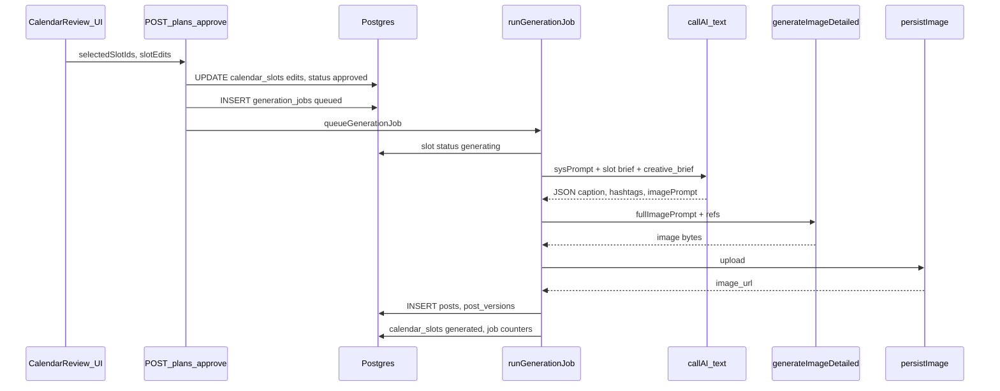

# Caption-to-image drift — flow and breakpoints

## Intended flow (calendar pipeline)

## Breakpoints (evidence-backed)

1. **Slot edits not fully persisted on approve**  
   [calendarPlan.js](../../src/routes/calendarPlan.js) only wrote `post_idea`, `caption_draft`, `creative_brief`. UI also edits `topic`, `creative_copy`, `hashtags_draft`, `format` — those were ignored, so generation could diverge from what the user reviewed.

2. **Image scene anchored to AI caption instead of planner caption**  
   Worker set `caption` from parsed JSON first, then built `SCENE ANCHOR` from that value. If the text model rewrote the caption away from the PVC/conduit story, the image prompt followed the wrong text even when `caption_draft` on the slot was correct.

3. **OpenAI image path ignores reference URLs**  
   [ai.js](../../src/lib/ai.js) `generateImageWithOpenAI` does not pass `referenceImageUrls`; only the Nano/Google path uses refs. Brand DNA + logo must be expressed in prompt text for OpenAI-only deployments.

4. **Model hallucination: social UI / text overlays**  
   Prompts forbid random text but image models still sometimes render mock UI. Extra negative constraints (“no Instagram frame / phone UI”) reduce frequency; optional future step is OCR/regenerate gate.

5. **Outputs list platform filter**  
   [posts.js](../../src/routes/posts.js) ignored `?platform=` while the UI sent it — confusing comparisons when debugging.

6. **Output detail download used wrong image**  
   [outputs/[postId]/page.tsx](../../frontend/src/app/(app)/outputs/[postId]/page.tsx) showed `displayVersion` but downloaded `post.image_url`.

## SQL trace

Run the queries in [generation-job-trace.sql](./generation-job-trace.sql) against production read-only and attach rows when opening a support ticket.

## Verification checklist (after deploy)

1. Create or open a calendar plan; set `caption_draft` on a slot to a specific product scene (e.g. PVC conduit on a workbench).
2. Approve with slot edits including `topic`, `creative_copy`, `hashtags_draft`; confirm DB row shows all fields updated.
3. Watch `/generate/queue`: thumbnails and `error_message` appear per slot; progress matches `completed_slots`.
4. Open the post in `/outputs`: caption matches expectation; download uses the same image as the selected version.
5. `GET /api/posts?platform=instagram` returns only matching rows.
6. Inspect `posts.generation_prompt` JSON: `imagePrompt` / enriched prompt should reference `USER_APPROVED_CAPTION` / scene anchor and must not encourage social UI mockups.
